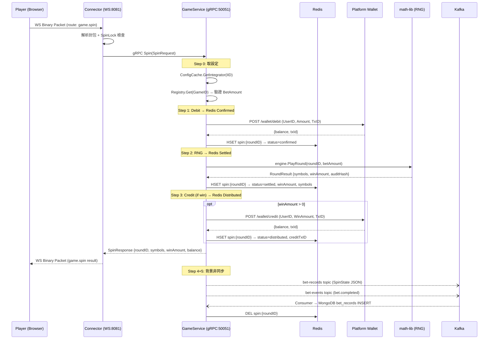

# 02 — 單人遊戲流程：Spin Lifecycle

## 適用遊戲

| 遊戲 | GameID | 類型 | math-lib Engine |
|------|--------|------|-----------------|
| 點鈔機 | `cashmachine` | 3-reel, 1-row slot | `engine/games/cashmachine/` |
| 小瑪莉 | `xiaomali` | 24-position board | `engine/games/xiaomali/` |

## Spin V2 完整流程

### Sequence Diagram



### 步驟詳解

#### Step 0：取得設定（同步）

```
ConfigCache.GetIntegrator(cmd.IID)  → WalletEndpoints (Debit/Credit/Cancel URLs)
ConfigCache.GetGame(cmd.GameID)     → 檢查遊戲是否 maintenance
Registry.Get(cmd.GameID)            → math-lib Engine → 驗證 BetAmount 範圍
```

- **程式碼**：`gameservice/internal/usecase/spin_v2/uc.go:67-83`

#### Step 1：Debit → Redis SaveConfirmed

1. 生成確定性 TxID：`DeterministicTxID(roundID, "debit")`
2. 設定 `walletTimeout = 12s` 呼叫平台 Debit
3. Debit 成功 → 建立 `SpinState` 寫入 Redis（`HSET` + `EXPIRE 10min`）
4. Redis 寫入失敗 → 立即 Cancel 補償

- **程式碼**：`gameservice/internal/usecase/spin_v2/uc.go:85-116`
- **Redis Key 格式**：`spin:{roundID}`
- **TTL**：10 分鐘（Recovery Worker 會掃描超時的 incomplete spin）

#### Step 2：RNG 計算 → Redis UpdateSettled

1. 依據遊戲類型呼叫 math-lib：
   - 有 `SelectedSymbols` → `PlayRoundWithSelection()`（小瑪莉選號）
   - 無 → `PlayRound()`（一般隨機）
2. RNG 成功 → 更新 Redis 狀態為 `Settled`
3. RNG 失敗 → 觸發 `handleRefund()` 退款

- **程式碼**：`gameservice/internal/usecase/spin_v2/uc.go:118-146`

#### Step 3：Credit（贏錢時）→ Redis UpdateDistributed

1. `winAmount > 0` 時才執行
2. 生成 `DeterministicTxID(roundID, "credit")`
3. 呼叫平台 Credit
4. Credit 成功 → 更新 Redis 為 `Distributed`
5. Credit 失敗 → 觸發 `handleRefund()` 退款

- **程式碼**：`gameservice/internal/usecase/spin_v2/uc.go:148-176`

#### Step 4+5：背景非同步（goroutine）

以下操作不阻塞玩家回應，在 `postSpinAsync()` 中執行：

1. **Kafka Publish**：將 `SpinState` 發布到 `bet-records` topic
2. **Redis DEL**：Kafka 發布成功後刪除 Redis 中的 SpinState
3. **UserStats 更新**：更新玩家統計（totalRounds, totalBet, totalWin）
4. **Domain Event**：發布 `bet.completed` 到 `bet-events` topic

- **程式碼**：`gameservice/internal/usecase/spin_v2/uc.go:178-193, 306-348`
- **Kafka Consumer**：`gameservice/internal/adapter/out/messaging/bet_record_consumer.go` 消費 `bet-records` 寫入 MongoDB

#### Step 6：組裝回傳結果

```go
Result{
    RoundID, Symbols, Reels, Rows,
    WinAmount, Balance, AuditHash,
    TargetIndex, PrizeID, Payload,
}
```

- 不等待 Kafka 或 MongoDB，直接回傳
- 玩家感知的延遲 ≈ Debit RTT + RNG + Credit RTT

---

## 異常處理

### Debit Timeout

```
Debit 超時 → cancelDebitWithCompensation()
  ├── Cancel 成功 → 結束（冪等）
  └── Cancel 失敗 → 寫入 Outbox → Worker 重試
```

- 使用**獨立 context**（`context.Background() + 5s timeout`），不受原 request context 影響

### RNG Failure

```
RNG 失敗 → handleRefund()
  ├── Cancel Debit（獨立 context）
  ├── Cancel 成功 → Redis UpdateRefunded → Kafka Publish → Redis DEL
  └── Cancel 失敗 → 寫入 Outbox
```

### Credit Failure

```
Credit 失敗 → handleRefund()
  （流程同 RNG Failure）
```

### Redis 寫入失敗（Step 1 SaveConfirmed）

```
Redis 失敗 → 無法追蹤此 spin → 立即 Cancel Debit 退款
```

- 這是最嚴重的情況——沒有 Redis 狀態就無法繼續 Spin 流程

### Recovery Worker（兜底機制）

定期掃描 Redis 中超過 5 分鐘的 incomplete spin，重新發布到 Kafka：

- **程式碼**：`gameservice/internal/usecase/spin_v2/recovery/`

---

## WebSocket 協議

### Request：`game.spin`

```
Binary Packet: Flag(1B) | ID(2B) | RouteLen(1B) | Route("game.spin") | Payload(JSON)
```

Payload：
```json
{
  "gameId": "cashmachine",
  "betAmount": 100,
  "roundId": "uuid-v4",
  "selectedSymbols": [1, 3, 5]    // 小瑪莉選號，點鈔機不需要
}
```

### Response：`game.spin` result

```json
{
  "roundId": "uuid-v4",
  "symbols": [7, 3, 5],
  "reels": 3,
  "rows": 1,
  "winAmount": 500,
  "balance": 9600,
  "auditHash": "sha256...",
  "targetIndex": 0,
  "prizeId": 0,
  "payload": "{...}"              // 遊戲特定詳細結果 JSON
}
```

---

## 關鍵程式碼路徑速查

| 功能 | 檔案 |
|------|------|
| Spin V2 UseCase | `gameservice/internal/usecase/spin_v2/uc.go` |
| Spin Contract (Command/Result) | `gameservice/internal/usecase/spin/contract.go` |
| BetRecord Entity | `gameservice/internal/domain/entity/bet_record.go` |
| SpinState (Redis DTO) | `gameservice/internal/domain/port/spin_state_store.go` |
| Wallet Gateway | `gameservice/internal/adapter/out/gateway/wallet_gateway.go` |
| Redis SpinStateStore | `gameservice/internal/adapter/out/redis/spin_state_store.go` |
| Kafka BetRecord Publisher | `gameservice/internal/adapter/out/messaging/bet_record_publisher.go` |
| Kafka BetRecord Consumer | `gameservice/internal/adapter/out/messaging/bet_record_consumer.go` |
| Recovery Worker | `gameservice/internal/usecase/spin_v2/recovery/` |
| WS Spin Handler (Connector) | `connector/internal/adapter/in/websocket/handler/handler_spin.go` |
| gRPC Server (GameService) | `gameservice/internal/adapter/in/grpc/server.go` |
| Proto 定義 | `proto/game.proto` |
| DI Container | `gameservice/internal/infrastructure/di/container.go` |

---

## 效能特性

| 指標 | V2 Spin 設計 |
|------|-------------|
| 玩家感知延遲 | ≈ Debit RTT + RNG + Credit RTT（毫秒級） |
| MongoDB 寫入 | 非同步（不阻塞回應） |
| Redis 狀態 TTL | 10 分鐘（兜底自動過期） |
| Kafka 失敗容忍 | Redis 保留狀態 + Recovery Worker 重試 |
| 併發控制 | Connector 層 SpinLock（每用戶排他） |
