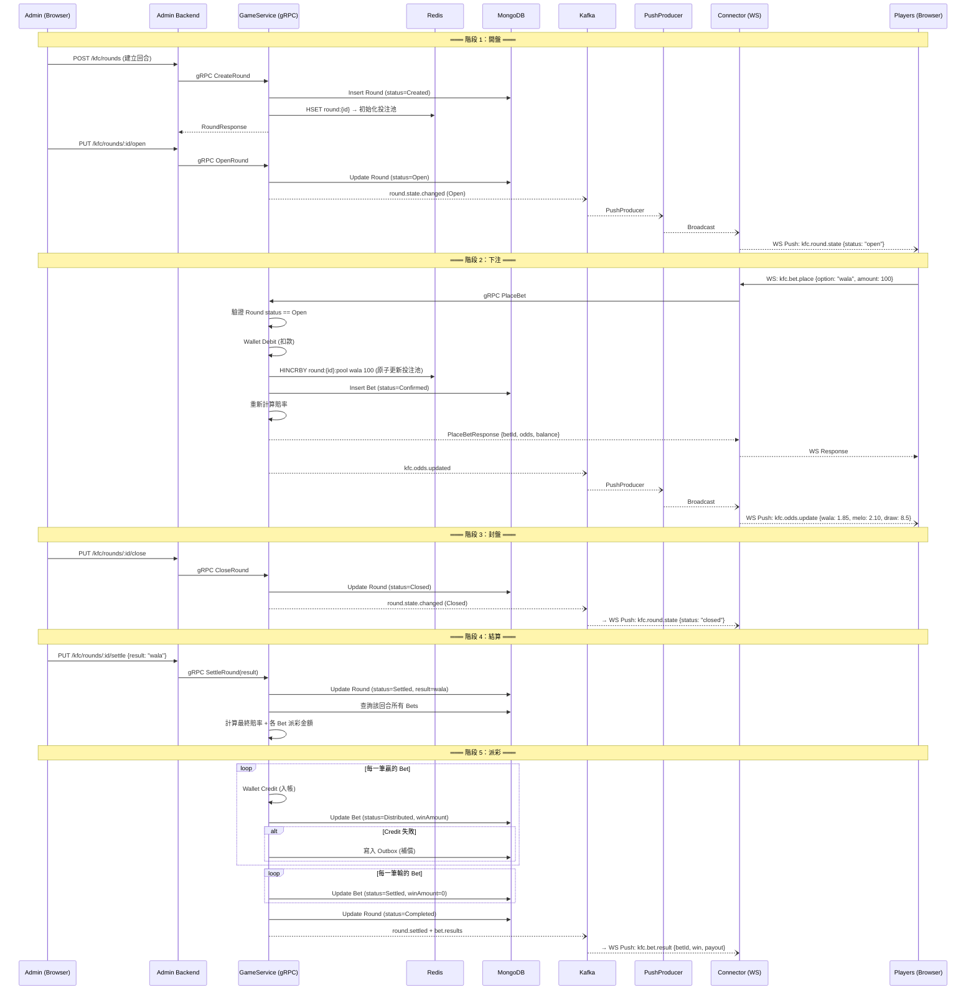
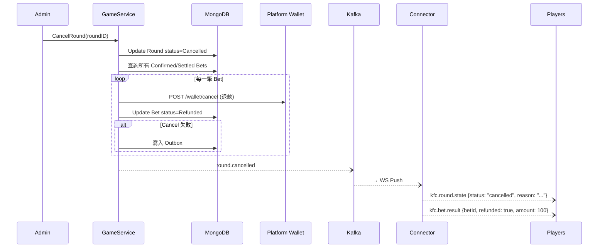

# 03 — 多人遊戲流程：Round Lifecycle

## 概念模型

### 「回合」vs「個人 Spin」的根本差異

| 面向 | 個人 Spin | 共享 Round |
|------|----------|-----------|
| 觸發者 | 玩家按下 Spin | 管理員開盤 |
| 參與人數 | 1 人 | N 人 |
| 結果決定 | 即時 RNG | 外部信號（賽事結果） |
| 下注時機 | 即按即扣款 | 開盤期間可下注，封盤後不可 |
| 結算時機 | Spin 完成即結算 | 回合結束後批次結算 |
| 資料模型 | 1 BetRecord = 1 Spin | 1 Round + N Bets |

**核心觀念：Round 是共享的 Aggregate Root，Bet 是個人的子紀錄。**

---

## Round 狀態機

```
                ┌───────────┐
                │  Created  │  ← 管理員建立回合（尚未開放下注）
                └─────┬─────┘
                      │ Admin: OpenRound
                ┌─────▼─────┐
           ┌───▶│   Open    │  ← 開盤中，玩家可下注
           │    └─────┬─────┘
           │          │ Admin: CloseRound
           │    ┌─────▼─────┐
           │    │  Closed   │  ← 封盤，不再接受下注，等待結果
           │    └─────┬─────┘
           │          │ Admin: SettleRound(result)
           │    ┌─────▼─────┐
           │    │  Settled  │  ← 結果已確定，系統正在批次派彩
           │    └─────┬─────┘
           │          │ 所有派彩完成
           │    ┌─────▼─────┐
           │    │ Completed │  ← 回合完全結束
           │    └───────────┘
           │
           │    ┌───────────┐
           └───▶│ Cancelled │  ← 管理員取消回合（任何 Open/Closed 狀態可觸發）
                └───────────┘
                  全額退款所有已下注玩家
```

### 狀態轉換規則

| 當前狀態 | 可轉換至 | 觸發者 | 條件 |
|---------|---------|--------|------|
| Created | Open | Admin | — |
| Open | Closed | Admin | — |
| Open | Cancelled | Admin | 全額退款 |
| Closed | Settled | Admin | 必須提供 result |
| Closed | Cancelled | Admin | 全額退款 |
| Settled | Completed | System | 所有 Bet 結算完成 |

> **不可逆性**：Settled 和 Completed 不可回退；Cancelled 為終態。

---

## 通用多人下注流程

### 完整回合生命週期 Sequence Diagram



---

## 五個階段詳解

### 階段 1：開盤（Admin → GameService）

1. 管理員在 Admin Backend 建立新回合，指定遊戲 ID
2. GameService 建立 Round Entity（status = `Created`）
3. Redis 初始化投注池計數器（所有選項歸零）
4. 管理員手動將回合轉為 `Open` 狀態
5. 系統廣播 `kfc.round.state` 推播給所有連線玩家

### 階段 2：下注（Players → Connector → GameService）

1. 玩家透過 WebSocket 發送下注請求
2. Connector 轉發到 GameService gRPC `PlaceBet`
3. GameService 驗證：
   - Round status == `Open`
   - 玩家餘額足夠
   - 投注金額在允許範圍內
   - 同一玩家同一回合同一選項不可重複下注（或合併）
4. **Wallet Debit**（同步扣款）
5. **Redis 原子更新**投注池（`HINCRBY`）
6. MongoDB 寫入 Bet（status = `Confirmed`）
7. 重新計算動態賠率
8. 回傳下注確認 + 廣播最新賠率

### 階段 3：封盤（Admin → GameService）

1. 管理員將回合轉為 `Closed`
2. 此後所有 `PlaceBet` 請求會被拒絕（Round not Open）
3. 廣播封盤通知

### 階段 4：結算（Admin → GameService）

1. 管理員提交外部賽事結果（例：`result = "wala"`）
2. GameService 更新 Round status = `Settled`，記錄 result
3. 查詢該回合所有 Bets
4. 根據最終投注池分佈計算各選項最終賠率
5. 計算每筆 Bet 的 `winAmount`：
   - 押中：`winAmount = betAmount × odds`
   - 未押中：`winAmount = 0`

### 階段 5：派彩（GameService → Wallet）

1. 遍歷所有贏的 Bet，逐筆呼叫 Wallet Credit
2. Credit 成功 → Bet status = `Distributed`
3. Credit 失敗 → 寫入 Outbox，Worker 重試
4. 所有輸的 Bet → status = `Settled`（不需 Credit）
5. 全部完成 → Round status = `Completed`
6. 推播個人結算結果給每位玩家

---

## 併發控制

### 多玩家同時下注

**問題**：多位玩家同時對同一回合下注，投注池計數器必須保持正確。

**解法**：Redis 原子操作

```
HINCRBY round:{roundID}:pool {option} {amount}   ← 原子增量，天然並發安全
HGETALL round:{roundID}:pool                      ← 讀取最新池子計算賠率
```

- 不需要分佈式鎖——Redis `HINCRBY` 本身是原子操作
- 賠率計算使用最新的池子快照，接受短暫的不一致（eventual consistency）

### Round 狀態轉換的排他鎖

**問題**：管理員封盤與玩家下注可能同時發生。

**解法**：

1. Round 狀態存在 MongoDB 中，狀態轉換使用 `findOneAndUpdate` + 條件過濾：
   ```
   filter: {_id: roundID, status: "open"}
   update: {$set: {status: "closed"}}
   ```
   如果狀態已非 `open`，更新不會生效（原子性保證）

2. PlaceBet 開始前先讀取 Round 狀態，若非 `Open` 立即拒絕

3. 極端情況（封盤瞬間的下注請求）：Debit 已完成但 Round 已 Closed → 走 Cancel 補償退款

### 下注時的 Round 狀態校驗

```
PlaceBet 流程：
1. 檢查 Round status == Open     ← 快速拒絕
2. Wallet Debit                   ← 扣款
3. 再次檢查 Round status == Open  ← Double Check（防止 Debit 期間被封盤）
   └── 若已 Closed → Cancel Debit 退款
4. Redis HINCRBY + MongoDB Insert
```

---

## 即時推播

### 推播事件類型

| WebSocket Route | 方向 | 觸發時機 | 推播範圍 |
|----------------|------|---------|---------|
| `kfc.round.state` | Server → Client | 回合狀態變更 | 所有連線玩家（Broadcast） |
| `kfc.odds.update` | Server → Client | 新的下注導致賠率變動 | 所有連線玩家（Broadcast） |
| `kfc.bet.result` | Server → Client | 回合結算完成 | 僅該下注的玩家（SendToUser） |

### 推播資料流

```
GameService → Kafka topic → PushProducer (消費) → Kafka WsEventPush → Connector (消費) → WebSocket Push
```

利用現有的 PushProducer gRPC 服務：
- **Broadcast**：`kfc.round.state`、`kfc.odds.update`
- **SendToUser**：`kfc.bet.result`

### 賠率更新推播策略

為避免高頻下注導致過多推播，可採用**節流（Throttle）**策略：

- 每次下注後更新 Redis 投注池
- 每 N 秒（例如 2 秒）或每 M 筆下注後才廣播一次最新賠率
- 結算時使用最終投注池計算精確賠率（不受推播頻率影響）

---

## 與單人流程的共用/差異對照表

| 面向 | 單人 Spin | 多人 Round | 共用程度 |
|------|----------|-----------|---------|
| Wallet Debit | 下注時扣款 | 下注時扣款 | **完全複用** |
| Wallet Credit | Spin 完成時 | 回合結算時 | **完全複用** |
| Wallet Cancel | 異常補償 | 異常補償 + 回合取消 | **完全複用** |
| ConfigCache | 取 Integrator endpoints | 取 Integrator endpoints | **完全複用** |
| Outbox Pattern | Credit 失敗補償 | Credit 失敗補償 | **完全複用** |
| EventPublisher | bet.completed | round.settled + bet.result | **介面複用**，事件類型不同 |
| Redis 用途 | SpinState 暫存 | 投注池計數器 + Round 快取 | **機制相似**，Key 結構不同 |
| 結果來源 | math-lib RNG | 外部信號 | **完全不同** |
| 狀態機 | BetRecord 個人狀態 | Round 全局 + Bet 個人 | **BetStatus 複用**，Round 全新 |
| 推播 | 僅回傳給個人 | 廣播 + 個人推播 | **PushProducer 複用** |

---

## 回合取消流程（Cancelled）


