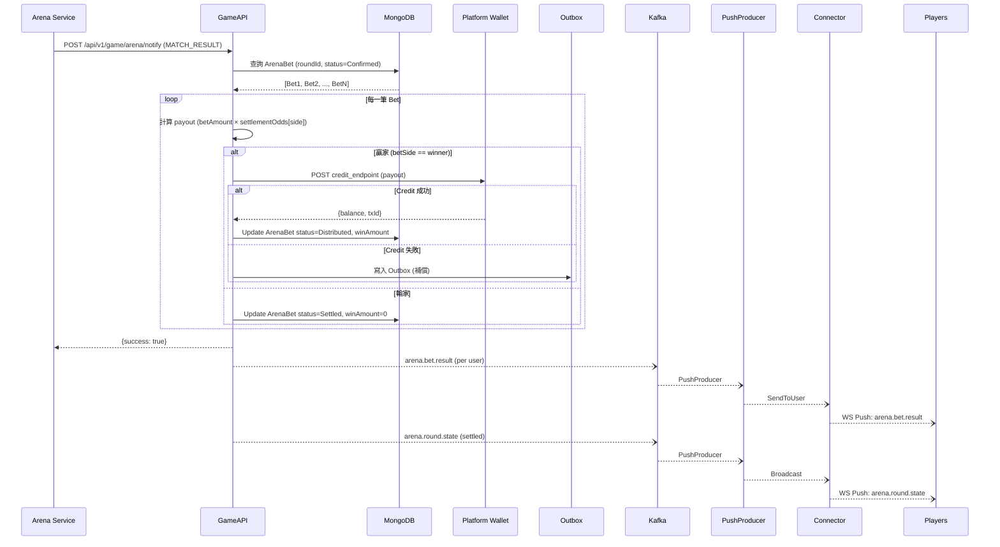

# 04 — Arena 賽事遊戲：Game-API 通知處理

## 概述

arena-service 在賽事狀態變更時，主動 POST 通知 GameAPI。GameAPI 負責接收通知、執行對應動作（推播 / 派彩 / 退款），**不主動查詢或操作 arena-service 的資料**。

---

## 通知端點

**位置**：`gameapi` service

```
POST /api/v1/game/arena/notify
```

### 通用 Request 格式

```json
{
  "tableId": "arena_M1774516456261",
  "roundId": "M1774516456261",
  "event": "BETTING_OPEN",
  "timestamp": "2026-03-31T08:00:00Z",
  "payload": { ... }
}
```

| 欄位 | 說明 |
|------|------|
| `tableId` | 桌台 ID，格式 `arena_{matchCode}` 或固定桌台代碼（如 `ARENA_T01`） |
| `roundId` | 局次 ID，同 matchCode（每場賽事 = 一局）；桌台事件為空字串 |
| `event` | 事件類型枚舉 |
| `timestamp` | ISO8601 事件時間 |
| `payload` | 事件攜帶資料（依 event 不同） |

### 通用 Response 格式

```json
{
  "success": true,
  "data": {
    "received": true,
    "processedAt": "2026-03-31T09:00:01Z"
  }
}
```

---

## 事件類型與 GameAPI 處理邏輯

### 1. `BETTING_OPEN` — 開放下注

**觸發時機**：管理員將賽事從 `pending` → `betting`

**Payload**：

```json
{
  "teamA": { "id": "team_001", "name": "六星炸雞", "code": "六星炸雞", "grade": "B" },
  "teamB": { "id": "team_002", "name": "協力旺", "code": "協力旺", "grade": "B" },
  "initialOdds": { "a": "2.00", "draw": "9.00", "b": "2.00" },
  "scheduledAt": "2026-03-31T09:00:00Z",
  "bettingDeadline": "2026-03-31T09:00:00Z",
  "rtp": 90
}
```

**GameAPI 處理**：

```
1. 記錄賽事開盤資訊（Redis / MongoDB 快取，供下注時參照）
2. 推播 → Kafka → PushProducer → Connector → WS Broadcast
   Route: arena.round.state
   Payload: 賽事資訊 + 初始賠率 + 狀態 "betting"
```

> 押注上限不在此 payload 中。GameService 的押注上限從 ConfigCache（config-service SSE push）取得。

---

### 2. `BETTING_CLOSED` — 結束下注（進行中）

**觸發時機**：管理員手動封盤，或到達 `scheduledAt` 自動封盤

**Payload**：

```json
{
  "reason": "SCHEDULED",
  "lockedOdds": { "a": "1.85", "draw": "12.00", "b": "2.15" },
  "totalBets": 15,
  "totalAmount": "45000"
}
```

| `reason` 值 | 說明 |
|-------------|------|
| `SCHEDULED` | 到達預定開賽時間，自動關閉下注 |
| `MANUAL` | 管理員手動關閉下注 |

**GameAPI 處理**：

```
1. 快取 lockedOdds（後續 MATCH_RESULT 的 settlementOdds 與此一致）
2. 標記該 roundId 不再接受下注
3. 推播 → WS Broadcast
   Route: arena.round.state
   Payload: 封盤通知 + lockedOdds + 狀態 "in_progress"
```

---

### 3. `MATCH_RESULT` — 比賽結果（正常結算）

**觸發時機**：管理員結算賽事

**Payload**：

```json
{
  "winner": "A",
  "winnerTeam": { "id": "team_001", "name": "六星炸雞" },
  "winReason": "疊出壘台",
  "settlementOdds": { "a": "1.85", "draw": "12.00", "b": "2.15" }
}
```

| `winner` 值 | 說明 |
|-------------|------|
| `A` | A 隊獲勝 |
| `B` | B 隊獲勝 |
| `DRAW` | 和局 |

**GameAPI 處理**（核心流程，詳見 06-結算派彩）：

```
1. 從 MongoDB 查詢該 roundId 的所有 ArenaBet（status = Confirmed）
2. 逐筆計算派彩：
   ├── 投注方 == winner → payout = betAmount × settlementOdds[side]
   └── 投注方 != winner → payout = 0
3. 贏家：Wallet Credit → 更新 ArenaBet status = Distributed
4. 輸家：更新 ArenaBet status = Settled（不需 Credit）
5. Credit 失敗 → 寫入 Outbox，Worker 重試
6. 推播個人結算結果 → SendToUser
   Route: arena.bet.result
7. 推播賽事結算完成 → Broadcast
   Route: arena.round.state
```

---

### 4. `MATCH_CANCELLED` — 賽事取消 / 中途停賽

**觸發時機**：管理員取消賽事（任何非結算狀態皆可）

**Payload**：

```json
{
  "reason": "MID_MATCH_SUSPENSION",
  "cancelReason": "選手受傷無法繼續",
  "previousStatus": "in_progress"
}
```

| `reason` 值 | 說明 |
|-------------|------|
| `PRE_MATCH_CANCEL` | 開賽前取消 |
| `MID_MATCH_SUSPENSION` | 中途停賽 |
| `SYSTEM_ERROR` | 系統異常取消 |

**GameAPI 處理**（詳見 06-取消退款）：

```
1. 從 MongoDB 查詢該 roundId 的所有 ArenaBet（status = Confirmed）
2. 逐筆呼叫 Wallet Cancel（全額退款）
3. 更新 ArenaBet status = Refunded
4. Cancel 失敗 → 寫入 Outbox，Worker 重試
5. 推播退款通知 → SendToUser
   Route: arena.bet.result（refunded: true）
6. 推播賽事取消 → Broadcast
   Route: arena.round.state
```

---

### 5. `TABLE_OPEN` — 桌台開放

**觸發時機**：管理員將桌台從 `maintenance` → `open`

**Payload**：

```json
{
  "tableName": "競技場 1 號桌",
  "maxCapacity": 500
}
```

**GameAPI 處理**：

```
推播 → WS Broadcast
Route: arena.table.state
Payload: { tableId, status: "open", tableName, maxCapacity }
```

> `roundId` 為空字串，桌台事件不關聯特定賽事。

---

### 6. `TABLE_CLOSED` — 桌台關閉（維護）

**觸發時機**：管理員將桌台從 `open` → `maintenance`

**Payload**：

```json
{
  "reason": "scheduled maintenance",
  "estimatedReopenAt": "2026-04-01T07:00:00Z"
}
```

**GameAPI 處理**：

```
推播 → WS Broadcast
Route: arena.table.state
Payload: { tableId, status: "maintenance", reason, estimatedReopenAt }
```

---

## 事件總覽

| Event | roundId | GameAPI 動作 | 複雜度 |
|-------|---------|-------------|--------|
| `BETTING_OPEN` | matchCode | 快取 + 推播 | 低 |
| `BETTING_CLOSED` | matchCode | 快取 lockedOdds + 推播 | 低 |
| `MATCH_RESULT` | matchCode | 查詢投注 → 計算派彩 → Credit → 推播 | **高** |
| `MATCH_CANCELLED` | matchCode | 查詢投注 → Cancel → 推播 | **高** |
| `TABLE_OPEN` | 空 | 推播 | 低 |
| `TABLE_CLOSED` | 空 | 推播 | 低 |

---

## 錯誤碼

| Code | 說明 |
|------|------|
| `INVALID_TABLE_ID` | tableId 不存在 |
| `INVALID_ROUND_ID` | roundId 不存在 |
| `INVALID_EVENT` | 不支援的 event 類型 |
| `INVALID_STATE_TRANSITION` | 狀態轉換不合法 |
| `PROCESSING_FAILED` | 內部處理失敗 |

---

## Sequence Diagram：MATCH_RESULT 完整流程


