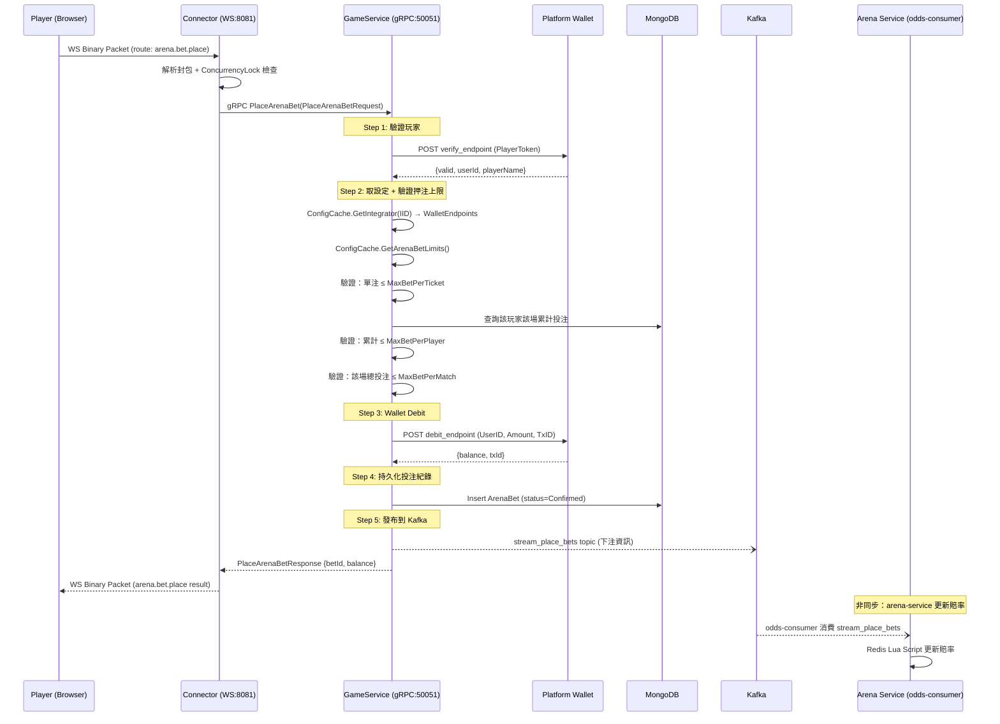

# 05 — Arena 賽事遊戲：玩家下注流程

## 概述

玩家下注時，請求經由 Connector → GameService (gRPC)。GameService 負責：
1. 驗證玩家身份
2. 驗證押注上限
3. 執行 Wallet Debit（扣款）
4. 持久化投注紀錄
5. 發布 Kafka `debit_records`（供 arena-service odds-consumer 更新賠率）

**GameService 不計算賠率、不管理回合狀態。** 賠率由 arena-service 計算並推播。

---

## 完整流程 Sequence Diagram



---

## 步驟詳解

### Step 1：驗證玩家

呼叫平台 `verify_endpoint` 確認：
- Token 有效
- 玩家未被停權
- 取得 `userId`、`playerName`

```
ConfigCache.GetIntegrator(cmd.IID) → verifyEndpoint URL
POST verifyEndpoint { playerToken }
→ { valid: true, userId: "player_001", playerName: "張三" }
```

### Step 2：押注上限驗證

從 ConfigCache 讀取 `ArenaBetLimitConfig`（由 config-service SSE push 同步）：

```
ArenaBetLimitConfig:
  MaxBetPerTicket:  10,000   ← 單注上限
  MaxBetPerPlayer:  50,000   ← 單玩家單場上限
  MaxBetPerMatch: 1,000,000  ← 單場總投注上限
```

驗證順序：

```
1. cmd.BetAmount ≤ MaxBetPerTicket
   └── 超過 → 回傳錯誤 BET_AMOUNT_EXCEEDED

2. 查詢 MongoDB: 該玩家該場累計投注額
   playerTotal + cmd.BetAmount ≤ MaxBetPerPlayer
   └── 超過 → 回傳錯誤 PLAYER_BET_LIMIT_EXCEEDED

3. 查詢 MongoDB: 該場總投注額
   matchTotal + cmd.BetAmount ≤ MaxBetPerMatch
   └── 超過 → 回傳錯誤 MATCH_BET_LIMIT_EXCEEDED
```

### Step 3：Wallet Debit（扣款）

```
1. 生成確定性 TxID：DeterministicTxID(roundId + betId, "debit")
2. 設定 walletTimeout = 12s
3. 呼叫平台 debit_endpoint
4. Debit 成功 → 繼續
5. Debit 失敗/超時 → 回傳錯誤（無需補償，尚未寫入紀錄）
```

- **冪等性**：TxID 保證重複呼叫不重複扣款
- **程式碼參考**：複用現有 `WalletClient.Debit()`

### Step 4：持久化投注紀錄

Debit 成功後，寫入 MongoDB `arena_bets` collection：

```
ArenaBet {
  BetID:        uuid
  RoundID:      matchCode (roundId)
  TableID:      tableId
  UserID:       userId (from verify)
  PlayerName:   playerName (from verify)
  IID:          平台商 ID
  Currency:     幣別
  BetSide:      "A" / "B" / "DRAW"
  BetAmount:    下注金額
  BetAmountUSD: USD 等值
  ExchangeRate: 下注當下匯率
  OddsAtBet:    下注時即時賠率（從推播快取讀取，僅參考用）
  Status:       Confirmed
  DebitTxID:    Wallet 回傳的 txId
  CreatedAt:    time.Now()
}
```

### Step 5：發布 Kafka `stream_place_bets`

> Topic 名稱為 `stream_place_bets`，以區分日後不同類遊戲的下注事件。

```json
Topic: stream_place_bets

{
  "gameId": "arena",
  "roundId": "M1774516456261",
  "tableId": "arena_M1774516456261",
  "userId": "player_001",
  "amout": "1000.0001",
  "recordTime": 1774939633,
  "betSide": "A"
}
```

| 欄位 | 類型 | 說明 |
|------|------|------|
| `gameId` | string | 遊戲 ID |
| `roundId` | string | matchCode |
| `tableId` | string | 桌台 ID |
| `userId` | string | 玩家 ID |
| `amout` | string | 下注金額（字串型別，保留小數精度） |
| `recordTime` | int64 | Unix timestamp（秒） |
| `betSide` | string | `"A"` / `"B"` / `"draw"` |

- arena-service 的 odds-consumer 消費此 topic
- 透過 Redis Lua Script 原子更新投注統計 + 重新計算賠率
- **GameService 不等待賠率更新結果**，發布後即回傳

---

## 異常處理

### Verify 失敗

```
verify_endpoint 回傳 invalid
→ 直接回傳錯誤 INVALID_PLAYER_TOKEN
→ 不做任何 Wallet 操作
```

### 押注上限超過

```
任一上限驗證失敗
→ 直接回傳對應錯誤碼
→ 不做任何 Wallet 操作
```

### Debit 超時

```
Debit 超時
→ 回傳錯誤 WALLET_TIMEOUT
→ 不寫入 ArenaBet（無需補償，Wallet 端冪等性保護）
```

### Debit 成功但 MongoDB 寫入失敗

```
MongoDB 寫入失敗
→ Wallet Cancel（退款）
→ Cancel 失敗 → 寫入 Outbox，Worker 重試
→ 回傳錯誤
```

### Kafka 發布失敗

```
Kafka 發布失敗
→ 寫入 Outbox（稍後重試發布到 stream_place_bets）
→ 不影響玩家回傳（下注已成功）
→ arena-service 賠率更新會延遲，但不影響正確性
```

---

## WebSocket 協議

### Request：`arena.bet.place`

```
Binary Packet: Flag(1B) | ID(2B) | RouteLen(1B) | Route("arena.bet.place") | Payload(JSON)
```

Payload：
```json
{
  "tableId": "arena_M1774516456261",
  "roundId": "M1774516456261",
  "betSide": "A",
  "betAmount": 1000
}
```

### Response：`arena.bet.place` result

```json
{
  "betId": "uuid",
  "roundId": "M1774516456261",
  "betSide": "A",
  "betAmount": 1000,
  "balance": 9000
}
```

### Error Response

```json
{
  "error": {
    "code": "BET_AMOUNT_EXCEEDED",
    "message": "Single bet amount exceeds limit"
  }
}
```

---

## 錯誤碼

| Code | 說明 |
|------|------|
| `INVALID_PLAYER_TOKEN` | 玩家 Token 無效或已過期 |
| `PLAYER_SUSPENDED` | 玩家已被停權 |
| `BET_AMOUNT_EXCEEDED` | 單注金額超過上限 |
| `PLAYER_BET_LIMIT_EXCEEDED` | 單玩家單場累計超過上限 |
| `MATCH_BET_LIMIT_EXCEEDED` | 單場總投注超過上限 |
| `MATCH_NOT_BETTING` | 賽事不在下注狀態 |
| `WALLET_TIMEOUT` | Wallet Debit 超時 |
| `WALLET_INSUFFICIENT_BALANCE` | 餘額不足 |
| `INTERNAL_ERROR` | 內部錯誤 |

---

## 押注上限設定同步路徑

```
管理員在後台修改押注上限
  → admin-backend API 呼叫 config-service REST API (PUT)
    → config-service 儲存至 DB + SSE push
      → GameService ConfigCache 即時更新
        → 下一筆下注即套用新上限
```

> 驗證在 GameService 執行，arena-service 不做押注上限驗證。
