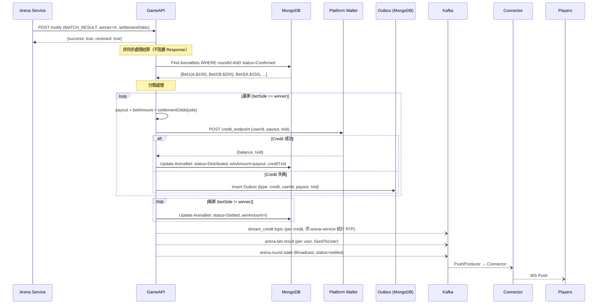
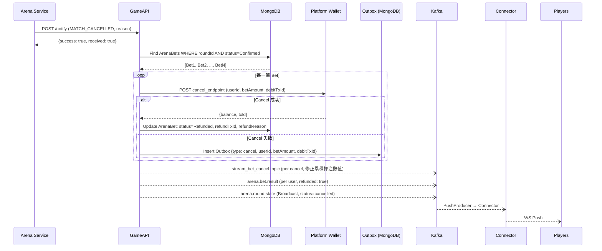

# 06 — Arena 賽事遊戲：結算派彩與取消退款

## 概述

結算和取消都由 **GameAPI** 處理，觸發點是收到 arena-service 的 Game-API 通知：
- `MATCH_RESULT` → 計算派彩 → Wallet Credit
- `MATCH_CANCELLED` → 全額退款 → Wallet Cancel

**GameAPI 不決定誰贏誰輸**——arena-service 提供 `winner` 和 `settlementOdds`，GameAPI 只負責「算錢 + 打錢 + 通知」。

---

## 結算流程（MATCH_RESULT）

### 完整 Sequence Diagram



### 步驟詳解

#### 1. 接收通知並回應

收到 `MATCH_RESULT` 後**立即回傳 success**，結算邏輯在背景非同步執行。避免 arena-service 等待逾時。

#### 2. 查詢投注紀錄

```
MongoDB Query:
  collection: arena_bets
  filter: { round_id: roundId, status: "confirmed" }
```

#### 3. 計算派彩金額

```
settlementOdds = { a: "1.85", draw: "12.00", b: "2.15" }
winner = "A"

對每筆 Bet:
  if bet.BetSide == "A":
    payout = bet.BetAmount × 1.85    ← 贏家
  if bet.BetSide == "B":
    payout = 0                        ← 輸家
  if bet.BetSide == "DRAW":
    payout = 0                        ← 輸家
```

**注意**：`settlementOdds` 是封盤時鎖定的賠率，由 arena-service 在 `BETTING_CLOSED` 時計算並快取，結算時原封不動傳來。GameAPI 不重新計算。

#### 4. Wallet Credit（贏家入帳）

```
對每筆贏家 Bet:
  1. txId = DeterministicTxID(betId, "credit")
  2. POST credit_endpoint { userId, amount: payout, txId }
  3. 成功 → Update ArenaBet:
       status = Distributed
       winAmount = payout
       creditTxId = txId
       distributedAt = now
  4. 失敗 → 寫入 Outbox
```

- **冪等性**：`txId` 確保重複 Credit 不重複入帳
- **獨立 context**：每筆 Credit 使用獨立 context（`context.Background() + 5s timeout`），單筆失敗不影響其他

#### 5. 更新輸家狀態

```
對每筆輸家 Bet:
  Update ArenaBet:
    status = Settled
    winAmount = 0
    settledAt = now
```

#### 6. 推播結果

**個人結算結果**（SendToUser）：

```json
Route: arena.bet.result

{
  "betId": "uuid",
  "roundId": "M1774516456261",
  "betSide": "A",
  "result": "A",
  "betAmount": 1000,
  "settlementOdds": 1.85,
  "winAmount": 1850,
  "won": true,
  "balance": 10850,
  "timestamp": "2026-03-31T09:35:00Z"
}
```

**賽事結算完成**（Broadcast）：

```json
Route: arena.round.state

{
  "tableId": "arena_M1774516456261",
  "roundId": "M1774516456261",
  "status": "settled",
  "winner": "A",
  "winnerTeam": "六星炸雞",
  "winReason": "疊出壘台",
  "timestamp": "2026-03-31T09:35:00Z"
}
```

#### 7. 發布 Kafka `stream_credit`（供 arena-service 統計跨平台 RTP）

每筆 Credit 成功後，發布到 `stream_credit` topic：

```json
Topic: stream_credit

{
  "gameId": "arena",
  "roundId": "M1774516456261",
  "tableId": "arena_M1774516456261",
  "userId": "player_001",
  "amout": "1850.0000",
  "recordTime": 1774939633
}
```

| 欄位 | 類型 | 說明 |
|------|------|------|
| `gameId` | string | 遊戲 ID |
| `roundId` | string | matchCode |
| `tableId` | string | 桌台 ID |
| `userId` | string | 玩家 ID |
| `amout` | string | 派彩金額（字串型別，保留小數精度） |
| `recordTime` | int64 | Unix timestamp（秒） |

> arena-service 消費此 topic 以統計賽局跨平台 RTP。

---

## 取消退款流程（MATCH_CANCELLED）

### 完整 Sequence Diagram



### 步驟詳解

#### 1. 查詢投注紀錄

```
MongoDB Query:
  collection: arena_bets
  filter: { round_id: roundId, status: "confirmed" }
```

#### 2. Wallet Cancel（全額退款）

```
對每筆 Bet:
  1. POST cancel_endpoint { userId, amount: betAmount, originalTxId: debitTxId }
  2. 成功 → Update ArenaBet:
       status = Refunded
       refundTxId = txId
       refundReason = payload.cancelReason
       refundedAt = now
  3. 失敗 → 寫入 Outbox
```

- **冪等性**：`originalTxId`（原始 Debit 的 TxID）確保重複 Cancel 不重複退款

#### 3. 推播通知

**個人退款通知**（SendToUser）：

```json
Route: arena.bet.result

{
  "betId": "uuid",
  "roundId": "M1774516456261",
  "betSide": "A",
  "betAmount": 1000,
  "refunded": true,
  "refundAmount": 1000,
  "balance": 10000,
  "reason": "選手受傷無法繼續",
  "timestamp": "2026-03-31T09:10:00Z"
}
```

**賽事取消**（Broadcast）：

```json
Route: arena.round.state

{
  "tableId": "arena_M1774516456261",
  "roundId": "M1774516456261",
  "status": "cancelled",
  "reason": "MID_MATCH_SUSPENSION",
  "cancelReason": "選手受傷無法繼續",
  "timestamp": "2026-03-31T09:10:00Z"
}
```

#### 4. 發布 Kafka `stream_bet_cancel`（修正 arena-service 累積押注數值）

每筆 Cancel 成功後，發布到 `stream_bet_cancel` topic：

```json
Topic: stream_bet_cancel

{
  "gameId": "arena",
  "roundId": "M1774516456261",
  "tableId": "arena_M1774516456261",
  "userId": "player_001",
  "amout": "1000.0001",
  "recordTime": 1774939633
}
```

| 欄位 | 類型 | 說明 |
|------|------|------|
| `gameId` | string | 遊戲 ID |
| `roundId` | string | matchCode |
| `tableId` | string | 桌台 ID |
| `userId` | string | 玩家 ID |
| `amout` | string | 退款金額（字串型別，保留小數精度） |
| `recordTime` | int64 | Unix timestamp（秒） |

> arena-service 消費此 topic 以扣減投注池中的累積押注金額，避免數值錯誤。

---

## 異常處理與補償

### Credit 失敗（結算時）

```
單筆 Credit 失敗
  → 寫入 Outbox (MongoDB event_outbox)
  → 不影響其他 Bet 的結算（獨立處理）
  → Outbox Worker 定期掃描重試
  → 重試成功 → 標記 sent + 更新 ArenaBet status=Distributed
  → 超過重試次數 → 移入 Dead Letter → 人工介入
```

### Cancel 失敗（取消時）

```
單筆 Cancel 失敗
  → 寫入 Outbox
  → 同上流程重試
  → 重試成功 → 更新 ArenaBet status=Refunded
```

### 結算中途服務重啟

```
GameAPI 收到 MATCH_RESULT 後開始結算
→ 部分 Bet 已 Distributed，部分尚未處理
→ 服務重啟

Recovery 策略：
  定期掃描：
    ArenaBet WHERE round_id IN (已結算的 roundId)
    AND status = Confirmed（仍未處理）
    AND createdAt < 5 分鐘前
  → 重新執行派彩（Credit 冪等性保護不會重複入帳）
```

### 重複通知（arena-service 重送）

```
GameAPI 收到重複的 MATCH_RESULT
→ 查詢 ArenaBet，所有 Bet 已非 Confirmed 狀態
→ 無需處理，直接回傳 success
→ 天然冪等
```

---

## 財務指標計算

結算完成後，可計算以下指標（可回報給 arena-service 或寫入獨立統計）：

```
totalBet    = SUM(所有 ArenaBet.BetAmount)   WHERE roundId
totalPayout = SUM(所有贏家 ArenaBet.WinAmount) WHERE roundId
GGR         = totalBet - totalPayout
actualRTP   = (totalPayout / totalBet) × 100
```

> **GLI Compliance**：ArenaBet 結算後不可修改（immutable），財務指標從紀錄聚合計算。
